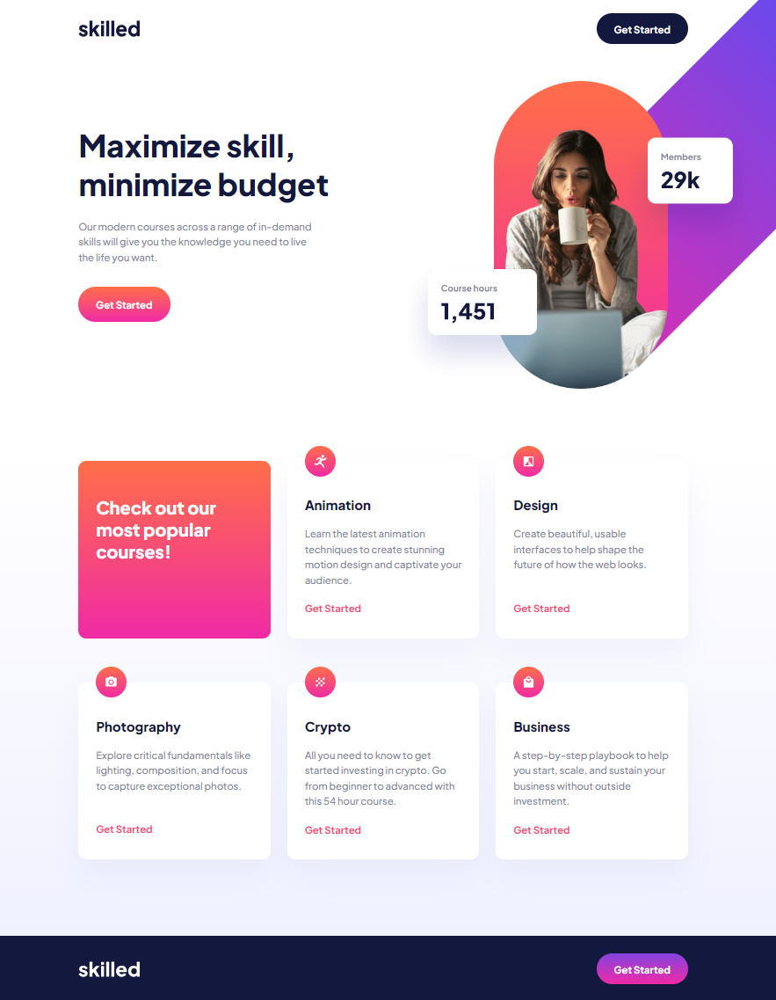
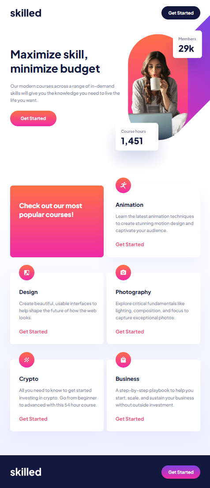
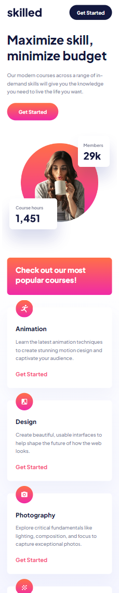

# Frontend Mentor - Skilled e-learning landing page solution

This is a solution to the [Skilled e-learning landing page challenge on Frontend Mentor](https://www.frontendmentor.io/challenges/skilled-elearning-landing-page-S1ObDrZ8q). Frontend Mentor challenges help you improve your coding skills by building realistic projects.

### Links

- Solution URL: https://github.com/aaronrubinstein/skilled-e-learning-landing-page
- Live Site URL: https://aaronrubinstein.github.io/skilled-e-learning-landing-page/

### Screenshots

**Desktop**

**Tablet**

**Mobile**

